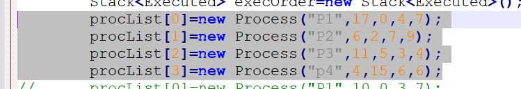
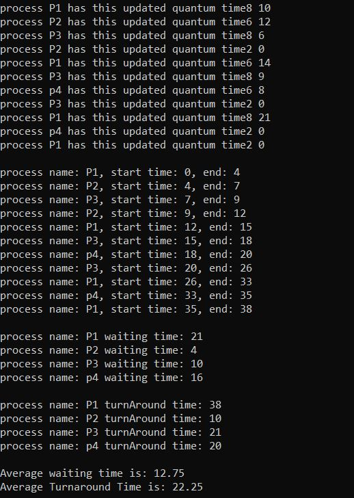
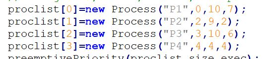
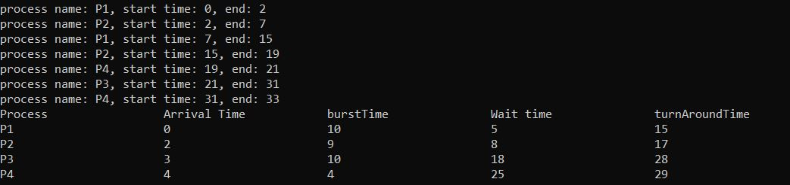
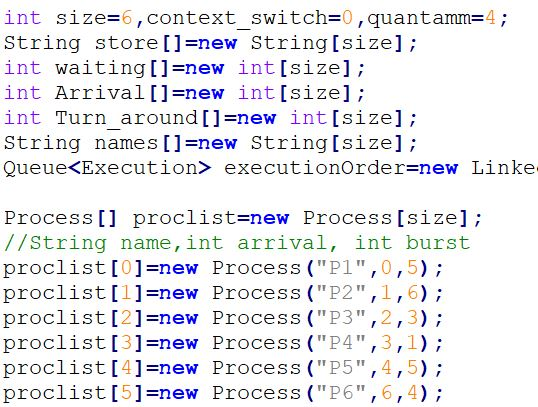
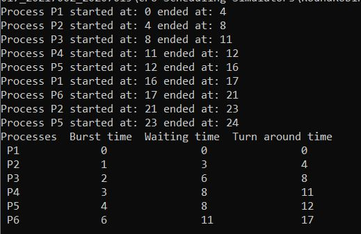

# CPU scheduling simulators
In this assignment, we are tasked with simulating the execution and waiting times of various processes using Java, applying the knowledge acquired during the OS course. You can find the description of the assignment in the uploaded document.

Within this repository, you will find only the code written by me, which includes the following scheduling algorithms: AG scheduling, Preemptive priority, and round robin.

## AG schduler - Modified Process scheduling simulator

This simulator allows you to input a set of processes with the following attributes: process name, burst time, arrival time, priority, and the total number of quantums. Detailed project information is available in the assignment PDF document.



The simulator provides results detailing the activity within the CPU, including start times, end times, the processes executed during CPU bursts, and updated quantums for each process. Additionally, it calculates the waiting and turnaround times for each process and the average waiting and turnaround times for all processes.

**output**




to run the project write these commands after installing Java environment

```
javac Mainclass.java
java Mainclass
```

## Preemptive Priority Scheduler

The Preemptive Priority scheduling algorithm is designed to prioritize processes based on their assigned priority values. Higher-priority processes get executed before lower-priority ones, and in case of a tie, the currently running process can be preempted.

### Input

To use the Preemptive Priority scheduler, you need to provide a set of processes with the following attributes for each process:
- Process name
- Burst time
- Arrival time
- Priority

Here is an example of the input format:



### Output

The simulator provides detailed information about the CPU's activity, including start times, end times, the processes executed during CPU bursts. Additionally, it calculates the waiting, turnaround, burst, and arrival times for each process.

Here is an example of the output format:



### Running the Project

To run the project, you can use the following commands after installing a Java environment:

```
javac PreemptivePrior.java
java PreemptivePrior
```
## Round Robin Scheduler

The Round Robin scheduling algorithm is a time-sharing system that allocates CPU time to each process in a cyclic and sequential manner. Each process is assigned a fixed time slice called a "quantum," and processes are executed in a circular queue fashion.

### Input

To use the Round Robin scheduler, you need to provide a set of processes with the following attributes for each process:
- Process name
- Burst time
- Arrival time
- Quantum (time slice)
- Context switch

Here is an example of the input format:



### Output

The Round Robin scheduler provides detailed information about the CPU's activity, including the start and end times for each process. It also calculates the waiting, turnaround, and response times for each process.

Here is an example of the output format:



### Running the Project

To run the project, you can use the following commands after installing a Java environment:

```
javac Roundrobin.java
java Roundrobin
```
