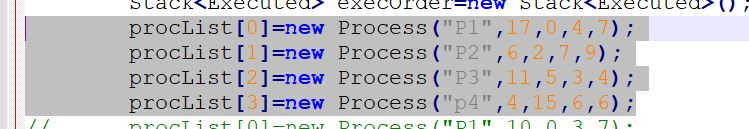
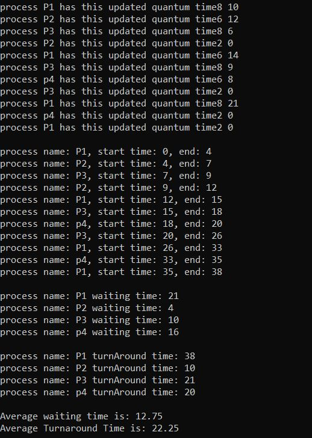

# CPU scheduling simulators
In this assignment, we are tasked with simulating the execution and waiting times of various processes using Java, applying the knowledge acquired during the OS course. You can find the description of the assignment in the uploaded document.

Within this repository, you will find only the code written by me, which includes the following scheduling algorithms: AG scheduling, Preemptive priority, and round robin.

#AG schduler - Modified Process scheduling simulator

This simulator allows you to input a set of processes with the following attributes: process name, burst time, arrival time, priority, and the total number of quantums. Detailed project information is available in the assignment PDF document.



The simulator provides results detailing the activity within the CPU, including start times, end times, the processes executed during CPU bursts, and updated quantums for each process. Additionally, it calculates the waiting and turnaround times for each process and the average waiting and turnaround times for all processes.

**output**




to run the project write these commands after installing Java environment

```
javac Mainclass.java
java Mainclass
```
